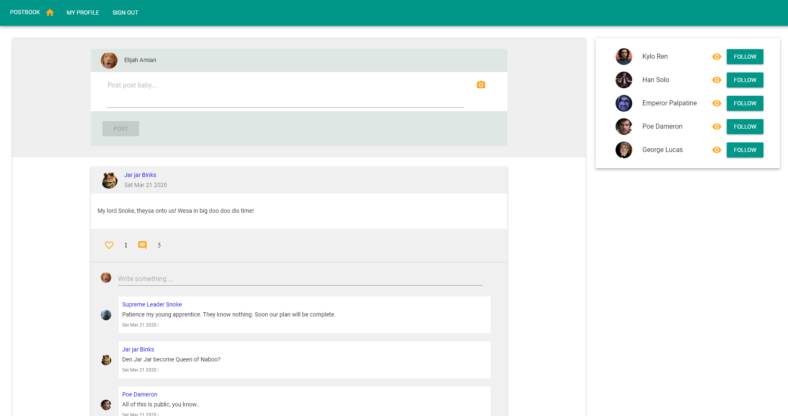
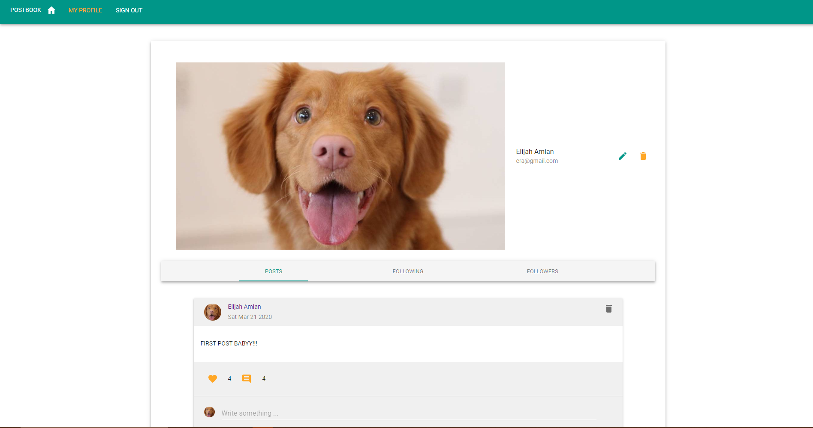
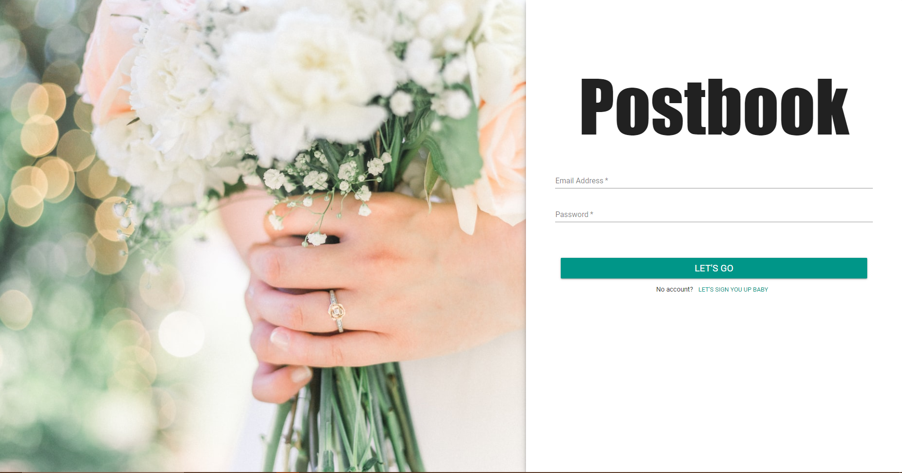

Postbook
---

 

Simple and easy to use social media for daily posts and seeing 
your other friend's post! 

Try It
---

Usage
---
1.) clone repo
2.) go to folder
3.) start mongodb localserver
4.) npm run build
5.) npm start
